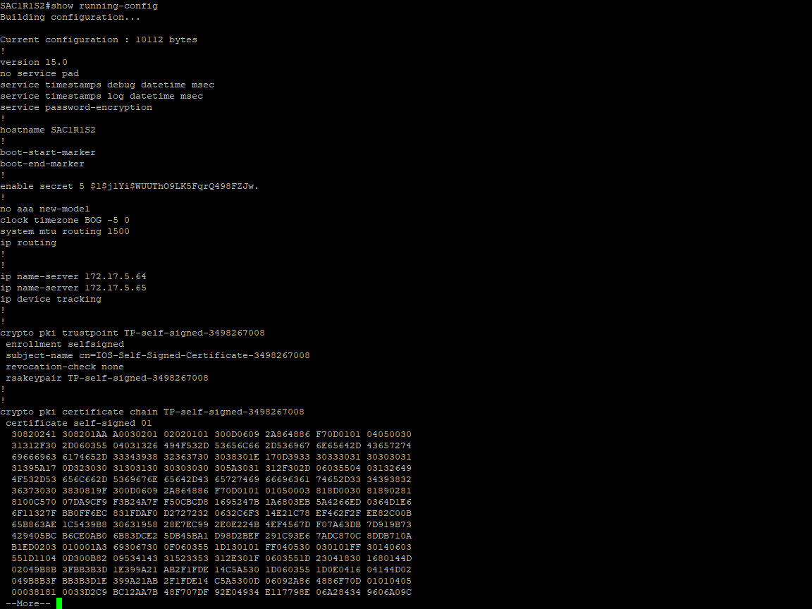
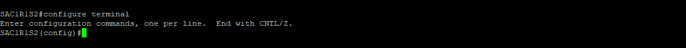
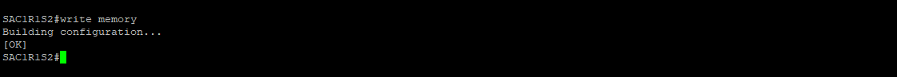

Conéctese al dispositivo. Ingrese la contraseña y presione la tecla **Enter** para continuar.


## Modo Privilegio
Ingrese el siguiente comando y presione la tecla **Enter**. Después, ingrese la contraseña del dispositivo y presione la tecla **Enter** para acceder al modo privilegiado:

```console
enable
```


> :pushpin: El símbolo **#** indica que se encuentra en Modo Privilegiado.

## Información SNMP
Verifique la información de SNMP en el dispositivo. Ingrese el siguiente comando y presione la tecla **Enter**:

```console
show running-config
```



> :pushpin: Si no hay información SNMP presente, continúe con estos pasos. Si hay algún comando SNMP registrado, se puede modificar o deshabilitar colocando **no** antes del comando.

## Modo Configuración
Ingrese el siguiente comando y presione la tecla **Enter** para acceder al modo configuración:

```console
configure terminal
```



> :pushpin: **(config)#** indica que se encuentra en modo configuración. Los comandos se pueden ingresar uno por línea o varias líneas al tiempo.

## Configuración SNMPv3
Se requiere configurar las siguientes variables:

1. **Grupo.** Especifica el nivel de seguridad que se va a utilizar.

    ### Niveles de seguridad
    | Nivel        | Descripción |
    | :----------: | ----------- |
    | noAuthNoPriv | Comunicación sin autenticación y sin privacidad |
    | authNoPriv   | Comunicación con autenticación y sin privacidad. Los protocolos que se utilizan para la autenticación son MD5 y SHA (Secure Hash Algorithm). |
    | authPriv     | Comunicación con autenticación y privacidad. Los protocolos que se utilizan para la autenticación son MD5 y SHA y para la privacidad son DES (Data Encryption Standard) y AES (Advanced Encryption Standard). |

2. **Usuario.** Pertenece al grupo anterior.

3. Apuntar el servidor al dispositivo, para habilitar las notificaciones.

### Creación de Grupo
```console
snmp-server group [nombre_grupo] [versión {v1 | v2c | v3 }] [nivel {auth | noauth | priv}]

```

### Creación de Usuario
```console
snmp-server user [nombre_usuario] [nombre_grupo] [versión {v1 | v2c | v3 }]  [autenticación {auth md5 | auth sha} [contraseña]] [privacidad {priv des | priv aes 128} [contraseña]]
```

### Notificaciones al Servidor
```console
snmp-server host [IP_servidor] traps version 3 [nivel {auth | noauth | priv}] [nombre_usuario]
```

```console
snmp-server enable traps
```

Ingrese **exit** y presione la tecla **Enter** para salir del modo de configuración.


### Creación de Comunidad (opcional)
Una comunidad de SNMP define un grupo de dispositivos y sistemas de administración. Solo los dispositivos y sistemas de administración que son miembros de la misma comunidad pueden intercambiar mensajes de SNMP. Un dispositivo o sistema de administración puede ser miembro de varias comunidades.

#### Cadena de comunidad de lectura RO
```console
snmp-server community nombre_comunidad RO
```

#### Cadena de comunidad de escritura RW
```console
snmp-server community nombre_comunidad RW
```

Ingrese el siguiente comando y presione la tecla **Enter** para guardar la configuración:

```console
write memory
```




## Verificación
Verifique la activación del protocolo SNMPv3. Ingrese el siguiente comando y presione la tecla **Enter**:

```console
show snmp
```


> :pushpin: Para ingresar estos comandos se debe estar en modo privilegio **enable**.
