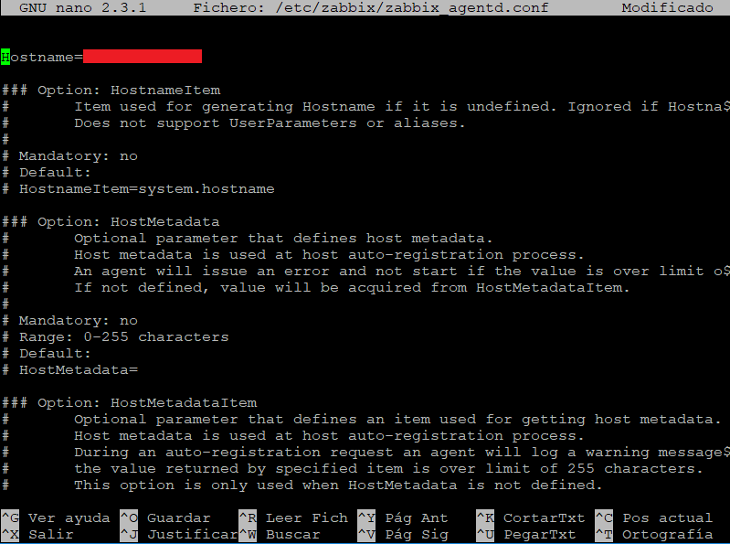

El agente Zabbix se instala en un equipo para monitorear activamente los recursos y aplicaciones locales (discos duros, memoria, estadísticas del procesador, etc).

## Plataformas Soportadas
Los agentes de monitoreo Zabbix son compatibles con:
- Linux
- IBM AIX
- FreeBSD
- NetBSD
- OpenBSD
- HP-UX
- Mac OS X
- Solaris: 9, 10, 11
- Windows: todas las versiones de escritorio y servidor desde XP

## Instalación en Linux
Ingrese el siguiente comando y presione la tecla **Enter** para instalar el agente desde paquetes de distribución:
```console
yum -y zabbix-agent
```
Inicie, verifique y habilite zabbix-agent. Ingrese los siguientes comandos y presione la tecla **Enter**:
```console
systemctl start zabbix-agent
```
```console
systemctl status zabbix-agent
```
```console
systemctl enable zabbix-agent
```

Ingrese el siguiente comando y presione la tecla **Enter** para abrir el archivo de configuración:
```console
nano /etc/zabbix/zabbix_agentd.conf
```


Línea 98: añada la dirección IP del servidor.
```console
Server=Dirección IP
```


Línea 118: añada la dirección IP del equipo.
```console
ListenIP=Dirección IP
```


Línea 141: añada la dirección IP del servidor activo.
```console
ServerActive=Dirección IP
```


Línea 152: añada el nombre del equipo.
```console
Hostname=Nombre del equipo
```

Guarde y cierre el archivo (**_Ctrl + o, Ctrl + x_** para el editor nano).

Para aplicar cambios, reinicie zabbix-agent. Ingrese el siguiente comando y presione la tecla **Enter**:
```console
systemctl restart zabbix-agent
```
