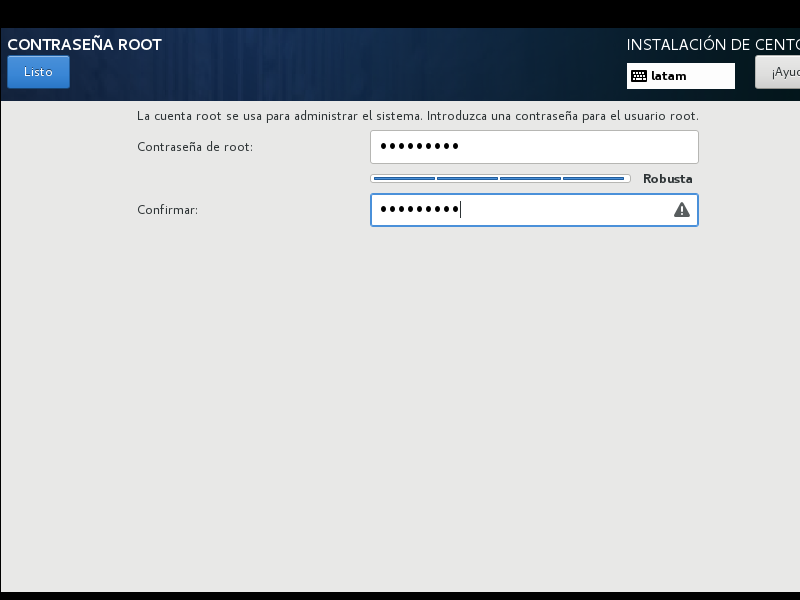

## Configuración de Red
## Modo Gui
> :pushpin: **nmtui** es una herramienta que interactúa con NetworkManager para configurar las interfaces de red en sistemas operativos Linux Red Hat y derivados.

Ingrese el siguiente comando y presione la tecla **Enter** para abrir la herramienta nmtui.

```console
nmtui
```

Seleccione **[Modificar una conexión]** y presione la tecla **Enter** para continuar.


Seleccione la interface a modificar, **[Editar...]** y presione la tecla **Enter** para continuar.


Cambie de **[Automática]** a **[Manual]** y seleccione **[Mostrar]**.


Ingrese los datos para configurar la interfaces. Seleccione **[Aceptar]** y presionar la tecla **Enter** para guardar.


Seleccione **[Atrás]** y presionar la tecla **Enter** para continuar.


Seleccione **[Salir]** o **[Aceptar]** y presionar la tecla **Enter** para terminar la configuración.


Para aplicar cambios, reinicie el servicio network. Ingrese el siguiente comando y presione la tecla **Enter**.

```console
systemctl restart network.service
```


## Modo Consola
Ingrese el siguiente comando y presione la tecla **Enter** para ubicar la interface a modificar.

```console
cd /etc/sysconfig/network-scripts/
```


Ingrese el siguiente comando y presione la tecla **Enter** para abrir el archivo de configuración.
```console
nano ifcfg-enp0s3
```


Línea 4: cambie de **none** a **static**.
```console
BOOTPROTO="static"
```

Línea 15: cambie de **no** a **yes**.
```console
ONBOOT="yes"
```
Línea 16: añada los datos de la red.
```console
IPADDR="xxx.xxx.xxx.xxx"
PREFIX=24
GATEWAY="xxx.xxx.xxx.xxx"
DNS1="xxx.xxx.xxx.xxx"
```


Guarde y se cierre el archivo (**Ctrl + o, Ctrl + x** para el editor nano).

Para aplicar cambios, reinicie el servicio network. Ingrese el siguiente comando y presione la tecla **Enter**.

```console
systemctl restart network.service
```

