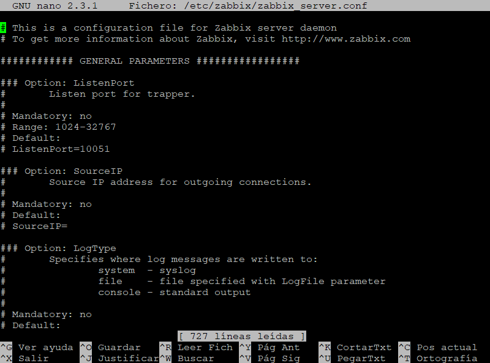
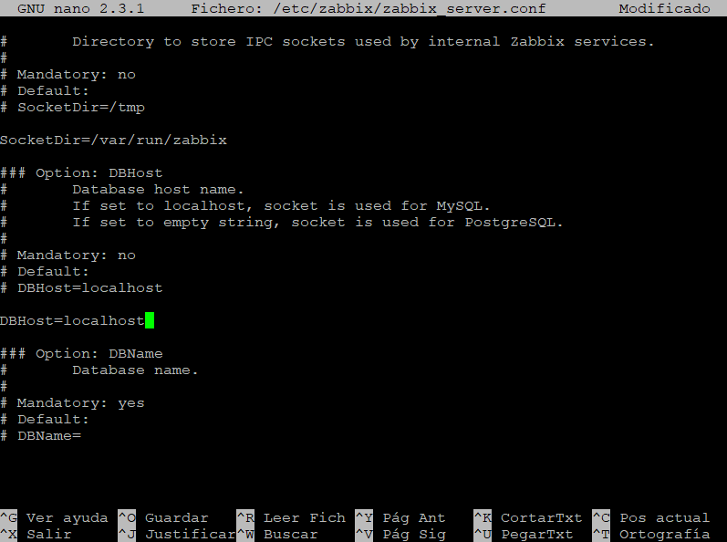
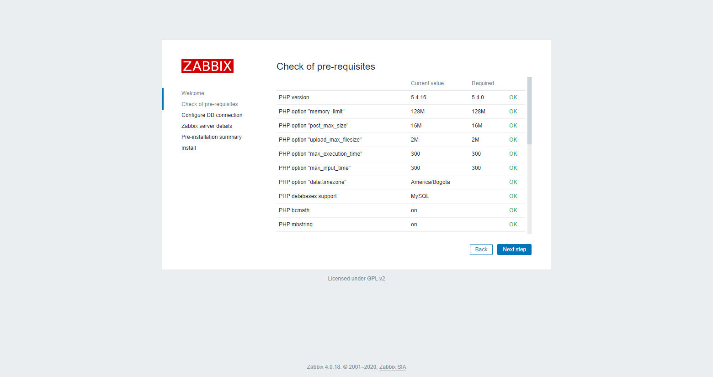
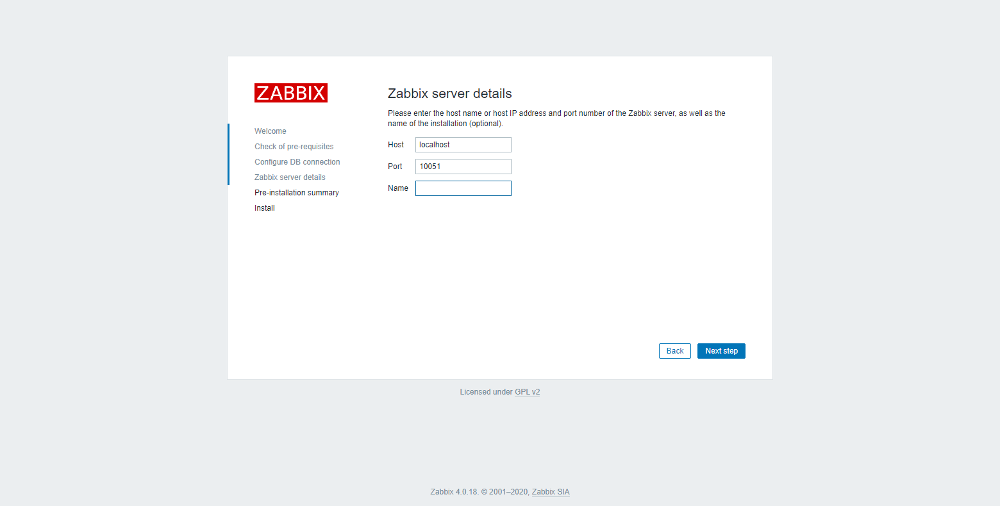
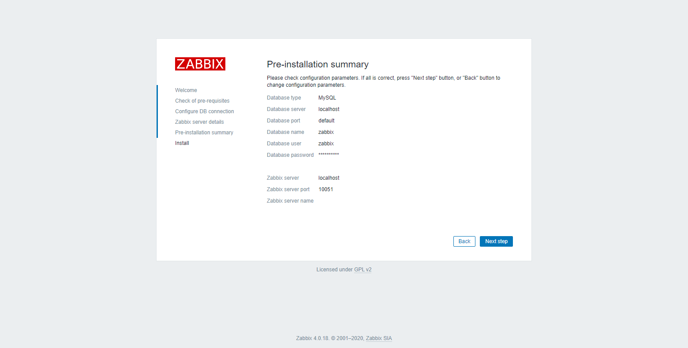

## Zabbix Server
Ingrese el siguiente comando y presione la tecla **Enter** para abrir el archivo de configuración:
```console
nano /etc/zabbix/zabbix_server.conf
```


Línea 92: añada el host de la base de datos.
```console
DBHost=localhost
```


Línea 128: añada la contraseña de la base de datos.
```console
DBPassword=password
```

Guarde y cierre el archivo (**_Ctrl + o, Ctrl + x_** para el editor nano).

Inicie, verifique y habilite zabbix-server y zabbix-agent. Ingrese los siguientes comandos y presione la tecla **Enter**:
```console
systemctl start zabbix-server zabbix-agent
```
```console
systemctl status zabbix-server zabbix-agent
```
```console
systemctl enable zabbix-server zabbix-agent
```

Si Firewalld se está ejecutando, permita el acceso de puertos. Ingrese los siguientes comandos y presione la tecla **Enter**.
```console
firewall-cmd --add-port={10051/tcp,10050/tcp} --permanent
```
```console
firewall-cmd --reload
```

## Apache
Ingrese el siguiente comando y presione la tecla **Enter** para abrir el archivo de configuración:
```console
nano /etc/httpd/conf.d/zabbix.conf
```


Línea 20: elimine el comentario y cambie la zona horaria de preferencia.
```console
php_value date.timezone America/Bogota
```

Guarde y cierre el archivo (**_Ctrl + o, Ctrl + x_** para el editor nano).

Para aplicar cambios, reinicie Apache. Ingrese el siguiente comando y presione la tecla **Enter**:
```console
systemctl restart httpd.service
```

## Zabbix Frontend
Acceda a la URL: **http://IP_servidor/zabbix** desde un navegador web.

En la primera pantalla se muestra la página de bienvenida. Haga clic en el botón **[Next step]** para continuar.


Verifique que se cumplen todos los requisitos previos de software. Haga clic en el botón **[Next step]** para continuar.


Ingrese los datos correspondientes para la conexión con la base de datos. Haga clic en el botón **_Next step_** para continuar.


Ingrese los datos del servidor. Haga clic en el botón **[Next step]** para continuar.


Verifique el resumen de la configuración. Haga clic en el botón **[Next step]** para continuar.


Haga clic en el botón **[Finish]** para completar la instalación.


Una vez finalice la instalación, se puede acceder a Zabbix Frontend. El nombre de usuario predeterminado es **Admin** y la contraseña es **zabbix**.

