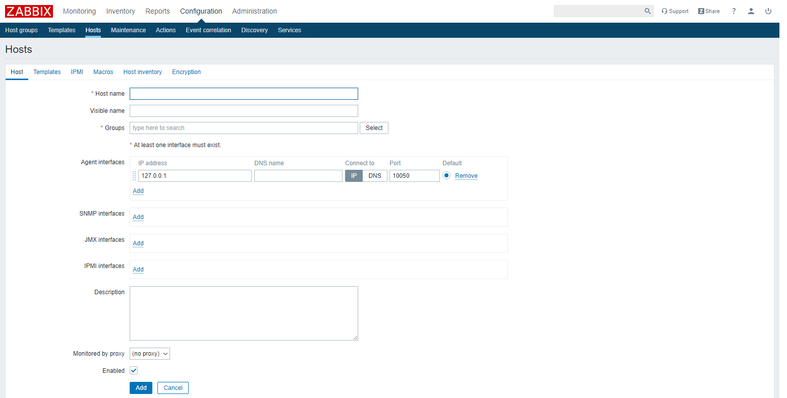
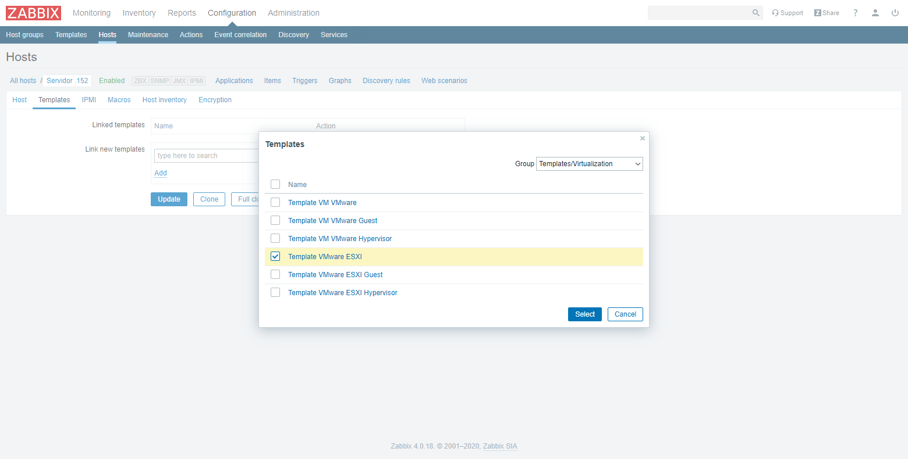

## Creación de Switch
Vaya al menú **Configuration** → **Host** y haga clic en el botón **[Create host]**.

### Datos del Equipo
Es necesario ingresar los siguientes campos:
- **Host name.** Nombre del equipo único
- **Groups.** Grupo en el que se quiere clasificar el equipo
- **SNMP interfaces.** Si se quiere monitorear el equipo mediante el protocolo SNMP. Es necesario ingresar la dirección IP y el puerto de comunicación.

Una vez ingresado los datos, haga clic en el botón **[Add]**.

### Vinculación de Plantillas
Una vez creado el equipo, se pueden configurar los datos a recopilar.

Vaya al menú **Configuration** → **Host** y haga clic en el nombre del equipo respectivo. Después, vaya a la pestaña **Templates**.

Es necesario seleccionar la plantilla a vincular. Utilice la barra de búsqueda o haga clic en el botón **[Select]**.

Marque la casilla de verificación respectiva y haga clic en el botón **[Select]**. Después, haga clic en el enlace **Add**.

### Macros
Vaya a la pestaña **Macros**. Es necesario ingresar los campos que requiere la plantilla.

Una vez ingresado los datos, haga clic en el enlace **Add**. Después, haga clic en el botón **[Update]**.

## Creación de Servidor
Vaya al menú **Configuration** → **Host** y haga clic en el botón **[Create host]**.

### Datos del Equipo
Es necesario ingresar los siguientes campos:
- **Host name.** Nombre del equipo único
- **Groups.** Grupo en el que se quiere clasificar el equipo
- **Agent interfaces.** Si se quiere monitorear el equipo mediante un agente Zabbix. Es necesario ingresar la dirección IP y el puerto de comunicación.

Una vez ingresado los datos, haga clic en el botón **[Add]**.

### Vinculación de Plantillas
Una vez creado el equipo, se pueden configurar los datos a recopilar.

Vaya al menú **Configuration** → **Host** y haga clic en el nombre del equipo respectivo. Después, vaya a la pestaña **Templates**.

Es necesario seleccionar la plantilla a vincular. Utilice la barra de búsqueda o haga clic en el botón **[Select]**.

Marque la casilla de verificación respectiva y haga clic en el botón **[Select]**. Después, haga clic en el enlace **Add**.

### Macros
Vaya a la pestaña **Macros**. Es necesario ingresar los campos que requiere la plantilla.

Una vez ingresado los datos, haga clic en el enlace **Add**. Después, haga clic en el botón **[Update]**.

## Visualización de Equipo
> :pushpin: Zabbix toma más o menos 1 hora para recopilar toda la información.

Vaya al menú **Monitoring** → **Latest data** y seleccione el equipo respectivo.

## Edición de Equipo
Vaya al menú **Configuration** → **Host** y haga clic en el nombre del equipo respectivo.

Una vez editado los datos, haga clic en el botón **[Update]**.

## Eliminación de Equipo
Vaya al menú **Configuration** → **Host** y  marque la casilla de verificación respectiva. Después, haga clic en el botón **[Delete]**.

