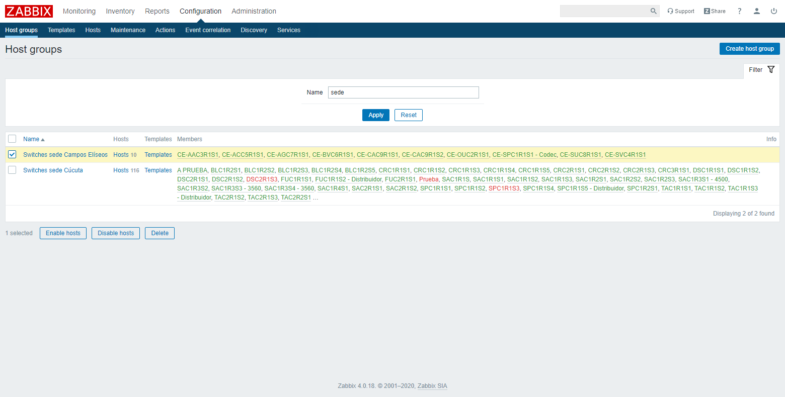

## Gestión de Grupos de Usuarios
### Creación de Grupo de Usuarios
Vaya al menú **Administration** → **User groups** y haga clic en el botón **[Create user group]**.

#### Datos de Grupo de Usuarios
Es necesario ingresar el campo **Group name**.

#### Permisos
Vaya a la pestaña **Permissons**.

Es necesario seleccionar el tipo de permisos ha asignar.

Una vez ingresado los datos, haga clic en el enlace **Add**. Después, haga clic en el botón **[Add]** para crear el nuevo grupo de usuarios.

### Edición de Grupo de Usuarios
Vaya al menú **Administration** → **User groups** y haga clic en el nombre del grupo de usuario respectivo.

Una vez editado los datos, haga clic en el botón **[Update]**.

### Eliminación de Grupo de Usuarios
Vaya al menú **Administration** → **User groups** y  marque la casilla de verificación respectiva. Después, haga clic en el botón **[Delete]**.

## Gestión de Grupos de Equipos
### Creación de Grupo de Equipos
Vaya al menú **Configuration** → **Host groups** y haga clic en el botón **[Create host group]**.

Es necesario ingresar el campo **Group name**.

Una vez ingresado el nombre del grupo, haga clic en el botón **[Add]**.

### Edición de Grupo de Equipos
Vaya al menú **Configuration** → **Host groups** y haga clic en el nombre del grupo de equipo respectivo.

Una vez editado los datos, haga clic en el botón **[Update]**.

### Eliminación de Grupo de Equipos
Vaya al menú **Configuration** → **Host groups** y  marque la casilla de verificación respectiva. Después, haga clic en el botón **[Delete]**.

