Inicie el sistema. Seleccione **Install CentOS 7** y presione la tecla **Enter** para continuar.
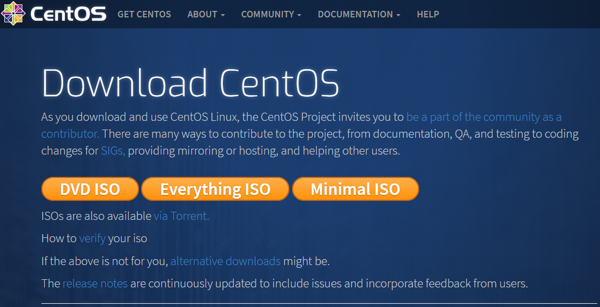

Si el arranque es correcto, se inicia el asistente de instalación.
Seleccione el idioma que se desea utilizar durante la instalación y haga clic en el botón **[Continuar]**.
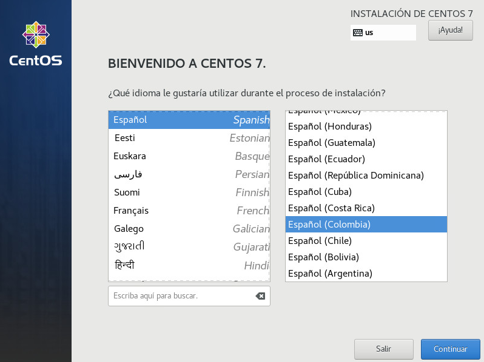

## Resumen de Instalación
La siguiente pantalla muestra un grupo de categorías a configurar antes de empezar la instalación.
- Regionalización (fecha & hora, teclado y soporte de idioma)
- Software (origen de instalación y selección de software)
- Sistema (destino de la instalación, KDUMP, red & nombre de equipo y security polity)

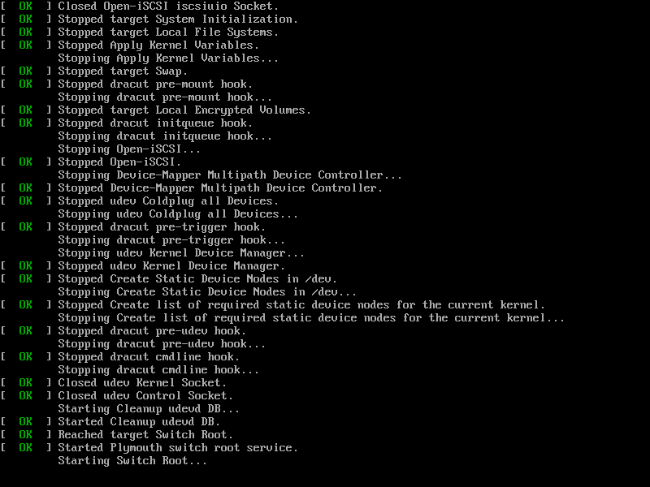

### Regionalización
#### Fecha y Hora
Seleccione la región y ciudad que desea establecer como zona horaria y haga clic en el botón **[Listo]**.

#### Teclado
Haga clic en el botón **[+]** para agregar otro tipo de teclado.
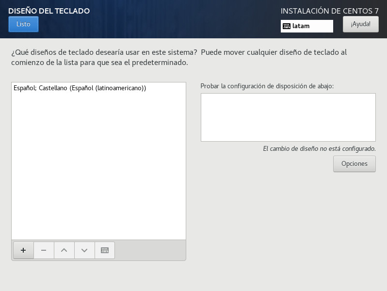

Seleccione el tipo de teclado y haga clic en el botón **[Agregar]**.

Después de agregar la distribución del teclado, haga clic en el botón **[Listo]**.

#### Soporte de Idioma
Seleccione el soporte de idioma y haga clic en el botón **[Listo]**.

### Software
#### Origen de Instalación
Por defecto, el origen de instalación es el medio de arranque. Seleccione la fuente de instalación y haga clic en el botón **[Listo]**.
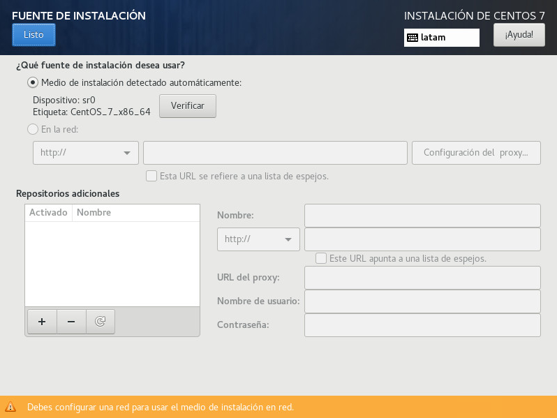

#### Selección de Software
La siguiente pantalla es muy importantes, ya que es donde se puede seleccionar el tipo de servidor y los paquetes que se desean instalar. Seleccione **Servidor de infraestructura** y el paquete **administración remota para linux**, el cual permitirá acceder remotamente al servidor. Después, haga clic en el botón **[Listo]**.

### Sistema
#### Destino de la Instalación
Seleccione el disco de instalación y haga clic en el botón **[Listo]**. Si desea personalizar los diseños de partición, marque la casilla **Voy a configurar las particiones** y continúe.
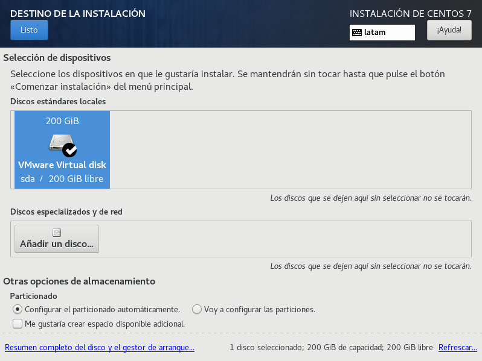

#### KDUMP
> :pushpin: **Kdump** es un mecanismo de volcado de memoria de daños de kernel. Si se presenta un fallo en el sistema, Kdump captura la información.

Marque la casilla y haga clic en el botón **[Listo]**.
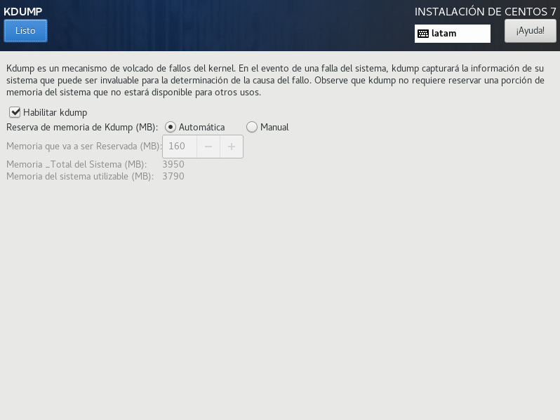

#### Red
El asistente detecta y configura las interfaces de red que están disponibles. Haga clic en el botón switch **[On]** y después, haga clic en el botón **[Listo]**.

#### Security Polity
> :pushpin: La aplicación de una política de seguridad no es necesaria en todos los sistemas. Esta pantalla sólo debe ser usada cuando se debe configurar una política específica.

Haga clic en el botón switch **[On]** y después, haga clic en el botón **[Listo]**.

Una vez finalice la configuración de cada elemento, haga clic en el botón **[Empezar instalación]** para continuar.
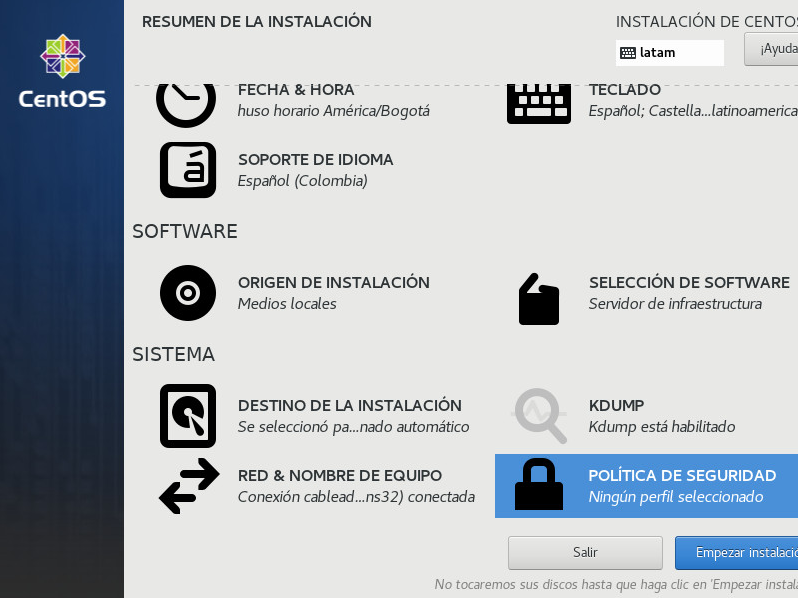

## Configuración de Perfil
Configure la contraseña del usuario root y si lo desea, cree un usuario.
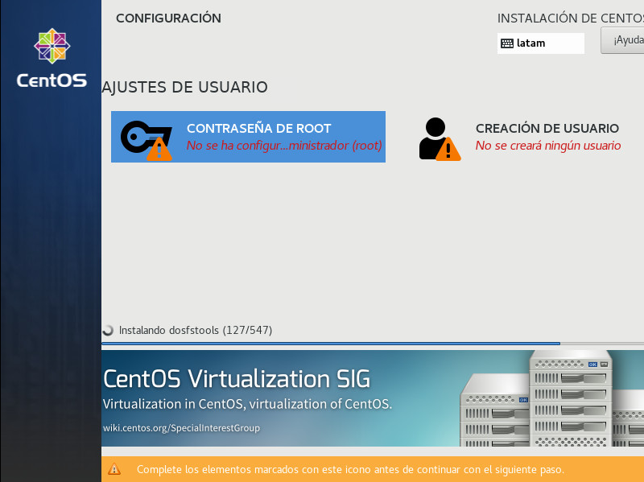

### Contraseña de Root
Ingrese la contraseña para el usuario root y haga clic en el botón **[Listo]**.
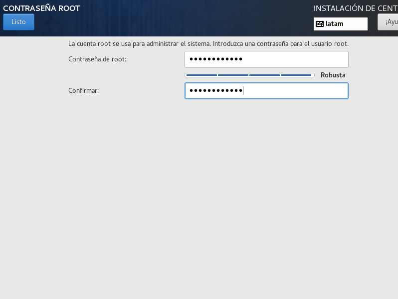

## Pasos Finales
Una vez finalice la configuración e instalación de paquetes, haga clic en el botón **[Reiniciar]** para completar la instalación.
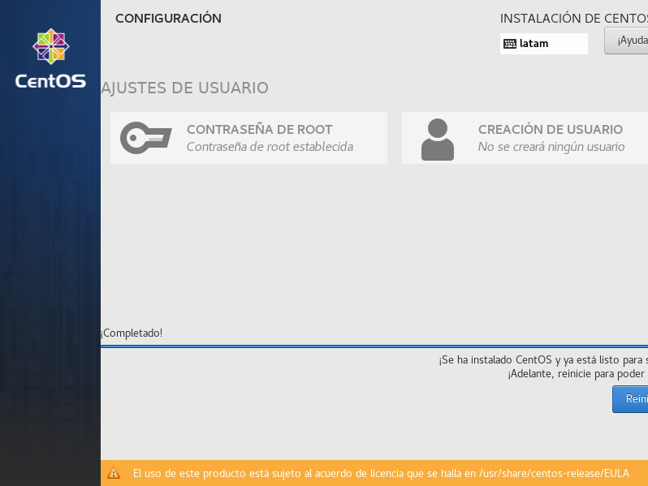

Después del reinicio, se muestra la pantalla de inicio de sesión. Inicie sesión con el usuario root y la contraseña que configuró durante la instalación. La instalación de CentOS se completa si puede iniciar sesión normalmente.
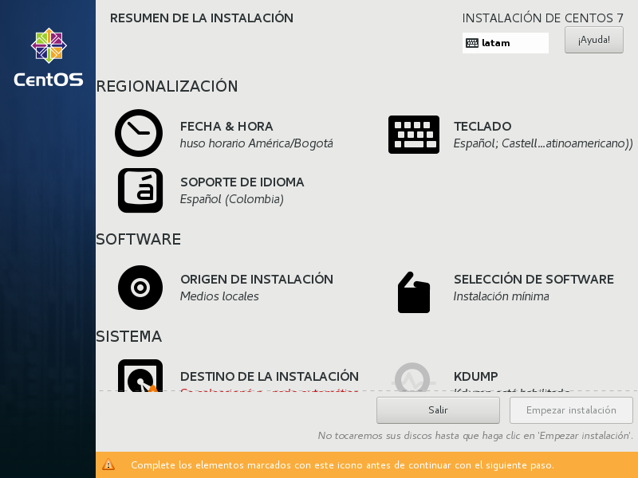
