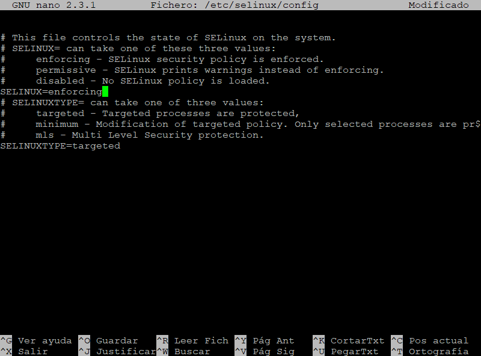
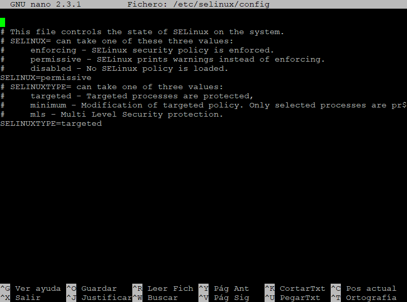
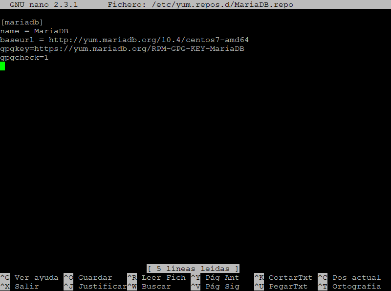
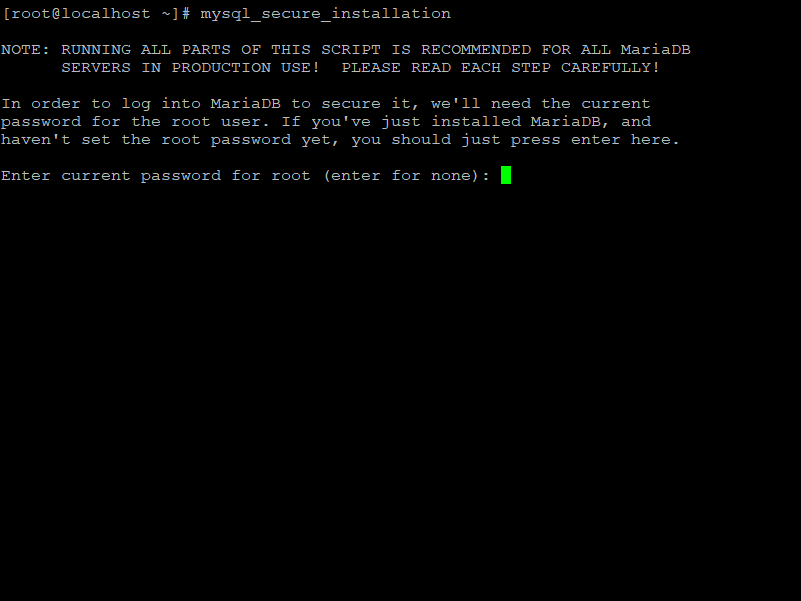
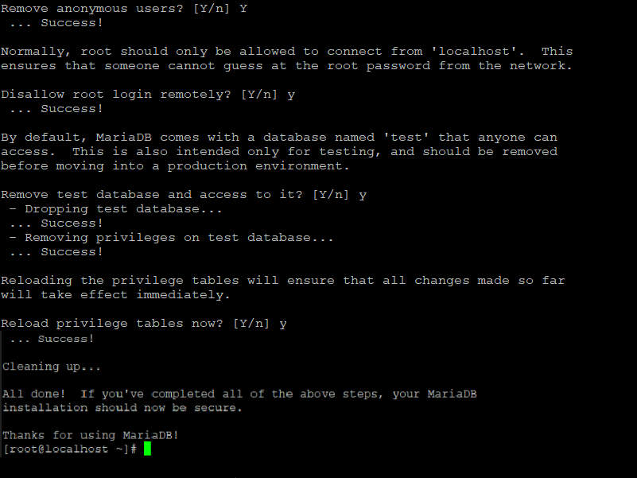

Antes de comenzar, se recomienda tener SELinux en modo permisivo. Ingrese el siguiente comando y presione la tecla **Enter** para abrir el archivo de configuración:
```console
nano /etc/selinux/config
```


Línea 7: cambie de **enforcing** a **permissive**.
```console
SELINUX=permissive
```


Guarde y cierre el archivo (**Ctrl + o, Ctrl + x** para el editor nano).

Para aplicar cambios, reinicie el servidor. Ingrese el siguiente comando y presione la tecla **Enter**:
```console
reboot
```

## Dependencias
### Apache
#### Instalación
Ingrese el siguiente comando y presione la tecla **Enter** para instalar el servidor web Apache:
```console
yum -y install httpd
```

#### Configuración
Ingrese el siguiente comando y presione la tecla **Enter** para abrir el archivo de configuración:
```console
nano /etc/httpd/conf/httpd.conf
```


Añada las siguientes líneas al final del archivo.
```console
ServerSignature Off
ServerTokens Prod
KeepAlive On
```

Guarde y cierre el archivo (**_Ctrl + o, Ctrl + x_** para el editor nano).

Inicie, verifique y habilite Apache. Ingrese los siguientes comandos y presione la tecla **Enter**:
```console
systemctl start httpd.service
```
```console
systemctl status httpd.service
```
```console
systemctl enable httpd.service
```

Si Firewalld se está ejecutando, permita el acceso de Apache. Ingrese los siguientes comandos y presione la tecla **Enter**:
```console
firewall-cmd --add-service=http --permanent
```
```console
firewall-cmd --add-service=https --permanent
```
```console
firewall-cmd --reload
```

### PHP
Ingrese el siguiente comando y presione la tecla **Enter** para instalar PHP y los paquetes requeridos para Zabbix:
```console
yum -y install php php-bcmath php-cli php-cgi php-common php-ctype php-devel php-gd php-gettext php-ldap php-mbstring php-mysql php-net-socket php-pear php-session php-snmp php-xml php-xmlwriter
```
Reinicie Apache. Ingrese el siguiente comando y presione la tecla **Enter**:
```console
systemctl restart httpd.service
```

### MariaDB
#### Instalación
Para instalar MariaDB 10.4, añada el repositorio a CentOS. Ingrese el siguiente comando y presione la tecla **Enter** para crear el archivo:
```console
nano /etc/yum.repos.d/MariaDB.repo
```

Añada las siguientes líneas.
```console
[mariadb]
name = MariaDB
baseurl = http://yum.mariadb.org/10.4/centos7-amd64
gpgkey=https://yum.mariadb.org/RPM-GPG-KEY-MariaDB
gpgcheck=1
```

Guarde y cierre el archivo (**_Ctrl + o, Ctrl + x_** para el editor nano).

Limpie la caché de índice. Ingrese el siguiente comando y presione la tecla **Enter**:
```console
yum makecache fast
```

Ingrese el siguiente comando y presione la tecla **Enter** para instalar MariaDB:
```console
yum -y install MariaDB-server
```

#### Configuración
Inicie, verifique y habilite MariaDB. Ingrese los siguientes comandos y presione la tecla **Enter**:
```console
systemctl start mariadb.service
```
```console
systemctl status mariadb.service
```
```console
systemctl enable mariadb.service
```

Si Firewalld se está ejecutando, permita el acceso de MariaDB. Ingrese los siguientes comandos y presione la tecla **Enter**:
```console
firewall-cmd --add-service=mysql --permanent
```
```console
firewall-cmd --reload
```

Ingrese el siguiente comando y presione la tecla **Enter** para realizar las configuraciones iniciales de MariaDB:
```console
mysql_secure_installation
```


Presione la tecla **Enter** para continuar.


Ingrese **Y** y presione la tecla **Enter** para actualizar la contraseña de MariaDB.

Ingrese la nueva contraseña y presione la tecla **Enter**. Después, ingrese nuevamente la contraseña para confirmar y presione la tecla **Enter** para continuar.


Ingrese **Y** y presione la tecla **Enter** para remover los usuarios anónimos.

Ingrese **Y** y presione la tecla **Enter** para deshabilitar el acceso remoto del usuario root.

Ingrese **Y** y presione la tecla **Enter** para remover la base de datos de prueba.

Ingrese **Y** y presione la tecla **Enter** para recargar las tablas de privilegios.



## Instalar de Zabbix
Hay cuatro formas de instalar zabbix:
- Instalación desde paquetes de distribución
- Instalación con archivo fuente
- Instalación desde contenedores (Docker)
- Instalación de Imagen Zabbix

> :pushpin: Para uso en producción, se recomienda instalar desde paquetes de distribución.  

Para instalar Zabbix 4.0 desde paquetes de distribución, añada el repositorio a CentOS. Ingrese los siguientes comandos y presione la tecla **Enter** para añadir el repositorio:
```console
rpm -Uvh https://repo.zabbix.com/zabbix/4.0/rhel/7/x86_64/zabbix-release-4.0-2.el7.noarch.rpm
```
```console
yum clean all
```

Ingrese el siguiente comando y presione la tecla **Enter** para instalar agente, get, zabbix server y frontend con soporte de MySQL:
```console
yum -y install zabbix-agent zabbix-get zabbix-server-mysql zabbix-web-mysql
```

> :warning: Antes de MariaDB v10.2.26, MariaDB no calculó correctamente los tamaños de fila mientras se ejecutaba DDL, por lo que se podían crear tablas inseguras, incluso con innodb_strict_mode = ON establecido. Los cálculos fueron corregidos por MDEV-19292.
Como efecto secundario, algunas tablas que se podían crear o modificar en versiones anteriores, pueden ser rechazadas con el siguiente error:
```console
ERROR 1118 (42000): Row size too large (> 8126). Changing some columns to TEXT or BLOB may help. In current row format, BLOB prefix of 0 bytes is stored inline.
```
Para evitar este error, zabbix sugiere deshabilitar innodb_strict_mode antes de la creación de la base de datos.

### Crear Base de Datos
Ingrese el siguiente comando y presione la tecla **Enter** para abrir la consola de MariaDB:
```console
mysql -u root -p
```

Ingrese la contraseña y presione la tecla **Enter**.

Ingrese el siguiente comando y presione la tecla **Enter** para deshabilitar innodb_strict_mode:
```console
set global innodb_strict_mode='OFF';
```

Ingrese los siguientes comandos y presione la tecla **Enter** para crear la base de datos de Zabbix:
```console
create database zabbix character set utf8 collate utf8_bin;
```
```console
grant all privileges on zabbix.* to zabbix@localhost identified by 'xxxxx';
```
```console
flush privileges;
```
```console
quit;
```


### Importar Base de Datos
Ingrese el siguiente comando y presione la tecla **Enter** para importar el esquema inicial:
```console
zcat /usr/share/doc/zabbix-server-mysql*/create.sql.gz | mysql -u zabbix -p zabbix
```
