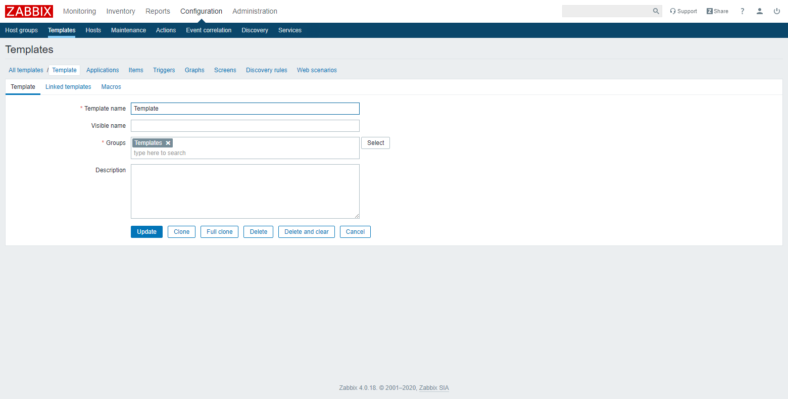

## Creación de Plantilla
Vaya al menú **Configuration** → **Templates** y haga clic en el botón **[Create template]**.

### Datos de la Plantilla
Es necesario ingresar los siguientes campos:
- **Template name.** Nombre de plantilla único
- **Groups.** Grupo en el que se quiere clasificar la plantilla

### Vinculación de Plantillas
Vaya a la pestaña **Linked templates**.

Es necesario seleccionar la plantilla a vincular.

Una vez seleccionada la plantilla, haga clic en el enlace **Add**.

### Macros
Vaya a la pestaña **Macros**.

Es necesario ingresar los siguientes campos:
- **Macro**. Nombre del macro único
- **value**. Valor del macro

Una vez ingresado los datos, haga clic en el enlace **Add**. Después, haga clic en el botón **[Add]** para crear la nueva plantilla.

### Creación de Grupo de parámetros
Una vez creada la plantilla, se pueden configurar los datos a recopilar.

Vaya al menú **Configuration** → **Templates** y haga clic en el nombre de la plantilla respectiva. Después, vaya a la pestaña **Applications** y haga clic en el botón **[Create application]**.

Es necesario ingresar el nombre de la aplicación (grupo de parámetros).

Una vez ingresado el nombre de la plantilla, haga clic en el botón **[Add]**.

### Creación de Parámetro
Vaya a la pestaña **Items** y haga clic en el botón **[Create item]**.

Es necesario ingresar los siguientes campos:
- **Name.** Nombre del parámetro único
- **Type.** Tipo de monitoreo
- **Key.** Nombre de la variable a solicitar
- **Type of information.** Tipo de dato a solicitar
- **Update.** Intervalo de actualización
- **Applications.** Grupo en el que se quiere clasificar el parámetro

> :pushpin: Dependiendo del tipo de monitoreo seleccionado, se piden más datos.

Una vez ingresados los datos, haga clic en el botón **[Add]**.

### Creación de Alerta
Vaya a la pestaña **Triggers** y haga clic en el botón **[Create trigger]**.

Es necesario ingresar los siguientes campos:
- **Name.** Nombre de la alerta
- **Severity.** Nivel de severidad de la alerta
- **Expression.** Condición de la alerta

Una vez ingresados los datos, haga clic en el botón **[Add]**.

### Creación de Grafica
Vaya a la pestaña **Graphs** y haga clic en el botón **[Create graph]**.

Es necesario ingresar los siguientes campos:
- **Name.** Nombre de la gráfica
- **Width.** Anchura de la gráfica
- **Height.** Altura de la gráfica

Una vez ingresados los datos, haga clic en el botón **[Add]**.

### Creación de Regla de Descubrimiento
Vaya a la pestaña **Discovery rules** y haga clic en el botón **[Create discovery rule]**.

Es necesario ingresar los siguientes campos:
- **Name.** Nombre de la regla de descubrimiento
- **Type.** Tipo de monitoreo
- **Key.** Nombre de la variable a solicitar
- **Update.** Intervalo de actualización

> :pushpin: Dependiendo del tipo de monitoreo seleccionado, se piden más datos.

Una vez ingresados los datos, haga clic en el botón **[Add]**.

## Edición de Plantilla
Vaya al menú **Configuration** → **Templates** y haga clic en el nombre de la plantilla respectiva.

Una vez editado los datos, haga clic en el botón **[Update]**.

## Eliminación de Plantilla
Vaya al menú **Configuration** → **Templates** y  marque la casilla de verificación respectiva. Después, haga clic en el botón **[Delete]**.

