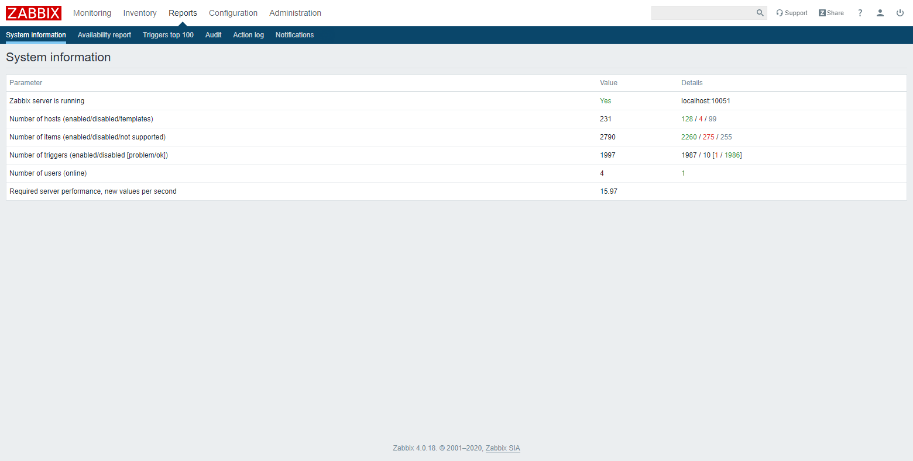
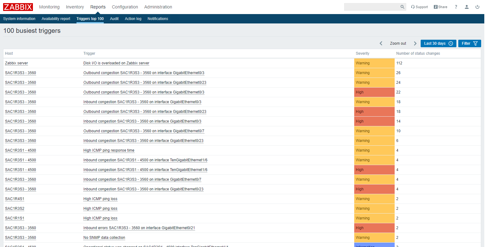

## Reporte del Sistema
Vaya al menú **Reports** → **System information**. Esta sección muestra un resumen de los datos clave del sistema.

## Reporte de Disponibilidad
Vaya al menú **Reports** → **Availability report**. Esta sección muestra el porcentaje de tiempo que las alertas han permanecido en un determinado estado, informando así sobre la disponibilidad de cada equipo.

## Reporte de Alertas
Vaya al menú **Reports** → **Triggers top 100**. Esta sección muestra las alertas que han cambiado su estado con mayor frecuencia dentro del período de evaluación.

## Reporte de Auditoria
Vaya al menú **Reports** → **Audit**. Esta sección muestra los registros de los cambios realizados en la interfaz.

## Reporte de Registro de Acción
Vaya al menú **Reports** → **Action log**. Esta sección muestra los detalles de las operaciones (notificaciones y comandos remotos) ejecutados dentro de una acción.

## Reporte de Auditoria
Vaya al menú **Reports** → **Notifications**. Esta sección muestra un informe sobre el número de notificaciones enviadas a cada usuario.

