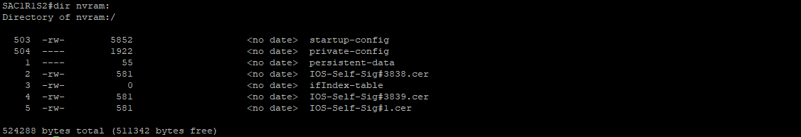
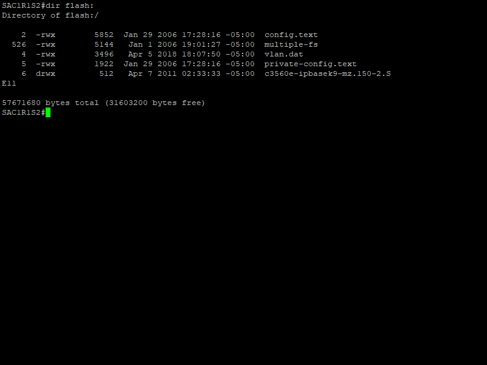

## Ingresar a la Consola
Conéctese al dispositivo. Ingrese la contraseña y presione la tecla **Enter** para continuar.


## Modo Privilegio
Ingrese el siguiente comando y presione la tecla **Enter**. Después, ingrese la contraseña del dispositivo y presione la tecla **Enter** para acceder al modo privilegiado:

```console
enable
```


> :pushpin: El símbolo **#** indica que se encuentra en modo privilegiado.

## Respaldo de Configuración
### Memoria NVRAM
La memoria NVRAM  se utiliza como almacenamiento permanente para el archivo de configuración de inicio (startup-config). Al igual que la ROM, la NVRAM no pierde el contenido cuando se apaga el dispositivo.

Ingrese el siguiente comando y presione la tecla **Enter** para ir a la Memoria NVRAM:

```console
dir nvram:
```



### Envió de archivo
Una vez se localiza el archivo startup-config se copia al servidor TFTP. Ingrese el siguiente comando y presione la tecla **Enter** para copiar el archivo:

```console
copy nvram:startup-config tftp
```

Se pedirán dos variables para continuar:
- Dirección IP del servidor TFTP
- Nombre del archivo copia


## Respaldo de Imagen IOS
### Memoria flash
La memoria flash se utiliza como almacenamiento permanente para el IOS y otros archivos relacionados con el sistema. El IOS se copia de la memoria flash a la RAM durante el proceso de arranque.

Ingrese el siguiente comando para ir a la Memoria Flash:

```console
dir flash:
```



> :pushpin: Cuando el dispositivo tiene interfaz web, aparecerá un directorio y no un archivo .bin. En caso de mostrarse un directorio, se debe ingresar al directorio y volver a ingresar el comando anterior.

Ingrese al directorio para ir a la Memoria Flash:

```console
cd nombre_directorio
```

```console
dir flash:
```


### Envió de archivo
Una vez se localiza el archivo .bin se copia al servidor TFTP. Ingrese el siguiente comando y presione la tecla **_Enter_** para copiar el archivo:

```console
copy flash: nombredelarchivo.bin tftp
```

Se pedirán dos variables para continuar:
- Dirección IP del servidor TFTP
- Nombre del archivo copia


