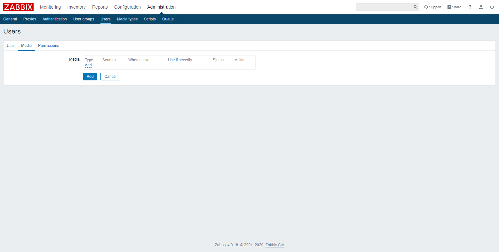
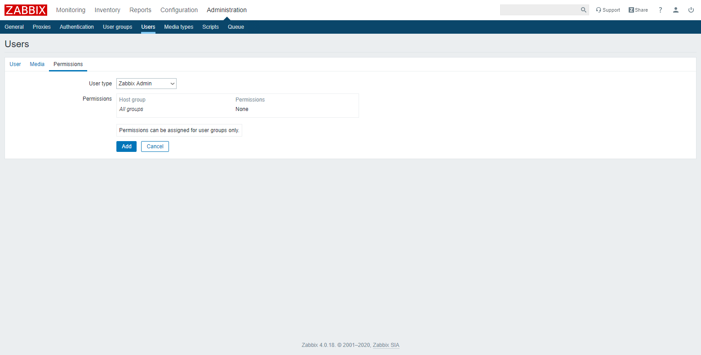

## Creación de Usuario
Vaya al menú **Administration** → **Users** y haga clic en el botón **[Create user]**.

### Datos de Usuario
Es necesario ingresar los campos:
- **Alias.** Nombre de usuario único, utilizado para iniciar sesión
- **Groups.** Grupo en el que se quiere clasificar el usuario
- **Password.** Contraseña utilizada para iniciar sesión
- **Password (once again).** Confirma la contraseña utilizada para iniciar sesión

### Media de notificación
Vaya a la pestaña **Media**.

Haga clic en el enlace **Add**.

Es necesario ingresar los campos:
- **Type.** Tipo de medio
- **Send to.** correo del usuario

> :pushpin: Dependiendo del tipo medio seleccionado, se piden más datos.

Una vez ingresado los datos, haga clic en el botón **[Add]**.

### Permisos
Vaya a la pestaña **Permissons**.

Es necesario seleccionar el campo **User type** para que se asignen los permisos.

Una vez ingresado los datos, haga clic en el botón **[Add]** para crear el nuevo usuario.

## Edición de Usuario
Vaya al menú **Administration** → **Users** y haga clic en el nombre del usuario respectivo.

Una vez editado los datos, haga clic en el botón **[Update]**.

## Eliminación de Usuario
Vaya al menú **Administration** → **Users** y  marque la casilla de verificación respectiva. Después, haga clic en el botón **[Delete]**.

## Cambio de Contraseña
Haga clic en el icono del perfil de usuario  en la esquina superior derecha de Zabbix Fronted.

Haga clic en el botón **[Change password]**.

Es necesario ingresar los campos:
- **Password.** Nueva contraseña de usuario
- **Password (once again).** Confirma la nueva contraseña de usuario

Una vez ingresado los datos, haga clic en el botón **[Update]** para actualizar la contraseña de inicio de sesión.
